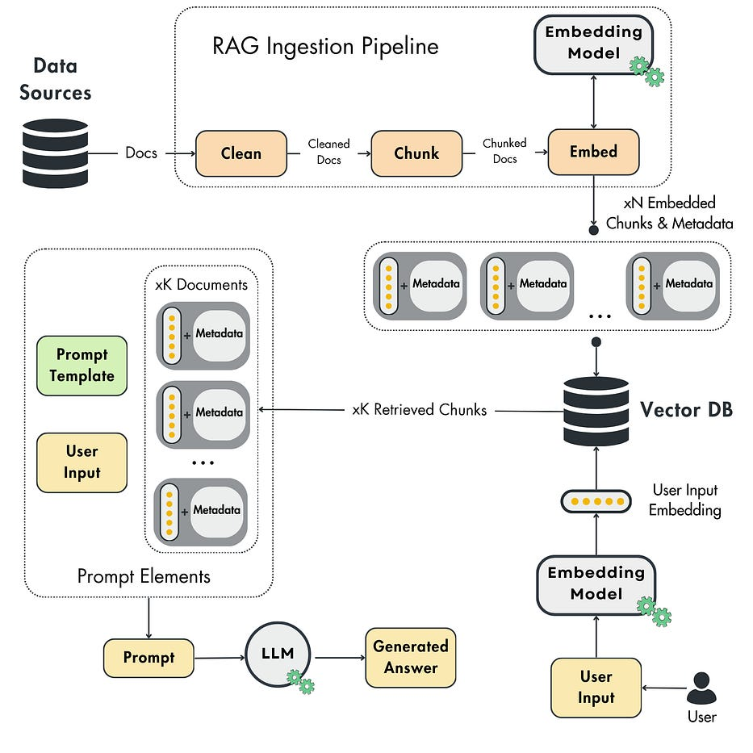

# rag-sv

Đây là dự án thử nghiệm RAG trên miền dữ liệu về VNU và các trường thành viên.

## 1. Pipeline

1. Thu thập dữ liệu (crawl data).
2. Xử lý dữ liệu (preprocessing).
3. Tạo vector database cho dữ liệu (vectordb).
4. Xây dựng module RAG như sau:
    - Nhận truy vấn.
    - Tìm kiếm thông tin liên quan trong database.
    - Kết hợp truy vấn với thông tin tìm được vào prompt.
    - Đưa prompt vào LLMs và nhận câu trả lời.

## 2. Sử dụng

### 2.1. Các bước sử dụng

- Chuẩn bị dữ liệu của domain, bộ Q&A ở dạng file json gồm các cặp Q/A.
- Tạo vectordb bằng lệnh `python prepare_vectordb.py`.
- Chạy thử nghiệm RAG `python run_rag.py`.

Vì file kết quả ở dạng json và chứa các bộ gồm Q/A/LLM_A nên bạn có thể chạy `python convert_results.py` để chuyển sang định dạng các file txt cho từng thành phần.

### 2.2. Tham khảo các notebook

- Notebook `test-rag-pipeline.ipynb` ghi lại quá trình tạo database, chuẩn bị LLMs, tạo câu trả lời và đánh giá chất lượng.
